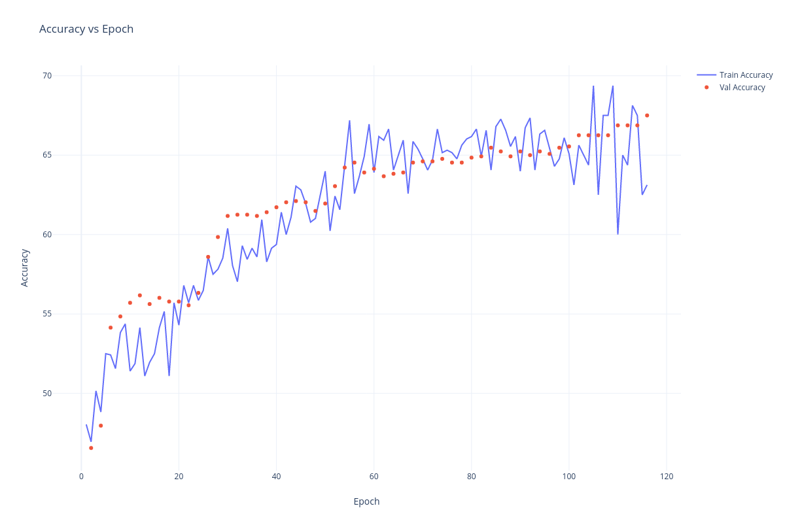
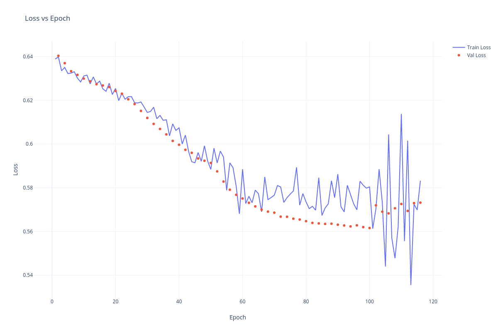

# Quantum Neural Network Classifier for PCam Dataset
---
This project implements a Quantum Neural Network (QNN) classifier for the PatchCamelyon (PCam) dataset. The PCam dataset contains histopathological image patches labeled for the presence of metastatic tissue. This implementation leverages near-pure quantum neural network models to explore the potential of quantum machine learning in medical imaging.

## Project Structure

The project contains the following main Python files:

### `main.py`

This file serves as the primary script for the initial training and evaluation of the Quantum Neural Network (QNN) model. Its responsibilities include:

*   Setting up the reproducible environment (random seeds, device configuration).
*   Defining and initializing the `QuantumNeuralNetwork` model, which integrates Qiskit-based quantum circuits with PyTorch.
*   Implementing custom data loading for the PCam dataset via the `PCamDataset` class.
*   Executing the main training loop, which includes forward/backward passes, loss computation (BCEWithLogitsLoss), optimization (AdamW), and learning rate scheduling (CosineAnnealingWarmRestarts).
*   Performing model evaluation using metrics like accuracy, AUC-ROC, precision, and recall.
*   Saving model checkpoints (e.g., version `optimized_fast_conv_regularized_v2`) and logging training progress.
*   Analyzing data distribution and initial model outputs for diagnostic purposes.

### `module.py`

This file acts as a central library of shared components and utilities essential for the QNN project. It encapsulates the core logic for data handling, model architecture, training, and evaluation, ensuring consistency across different experimental scripts. Key components include:

*   **`PCamDataset`**: A custom PyTorch `Dataset` class specifically designed for loading and preprocessing the PatchCamelyon (PCam) image data from `.h5` files.
*   **`QuantumNeuralNetwork`**: The primary class defining the Quantum Neural Network architecture. This includes the integration of Qiskit-based quantum circuits (e.g., feature maps like `ZZFeatureMap` and variational forms like `TwoLocal`) with a classical classification PyTorch linear layer to form a hybrid model.
*   **`QuantumParameterInitializer`**: A utility class or functions responsible for initializing the parameters of the quantum circuits, potentially offering different strategies (e.g., 'structured', random).
*   **`QuantumCircuitCache`**: (If implemented) A mechanism to cache the results of quantum circuit simulations or executions to speed up training, especially for repeated inputs.
*   **Data Processing Utilities**:
    *   `preprocess_data`: Functions for preparing input data before it's fed into the model.
    *   `extract_rotation_invariant_features`: Custom feature extraction logic applied to images.
*   **Training and Evaluation Utilities**:
    *   `calculate_accuracy`: Computes various performance metrics such as accuracy, AUC-ROC, precision, and recall.
    *   `set_all_seeds`: Ensures reproducibility by setting random seeds for PyTorch, NumPy, and Python's random module.
    *   `EarlyStopping`: Implements early stopping logic to prevent overfitting during training by monitoring validation or test metrics.
    *   `MetricsTracker`: A class for systematically collecting and logging detailed metrics during training and evaluation for research purposes.
    *   `save_checkpoint`: A standardized function for saving model state, optimizer state, and training progress, used by `main.py`, `extended.py`, and `extended_further.py`.
*   **Diagnostic and Analysis Tools**:
    *   `get_quantum_circuit_metrics`: Functions to retrieve or calculate metrics related to the quantum circuits themselves (e.g., depth, number of CNOTs).
    *   `analyze_data_distribution`: Utilities to inspect and understand the distribution of the dataset.
    *   `test_model_output`: Functions to perform sanity checks or detailed analysis of the model's outputs on sample data.
    *   `prepare_balanced_model`: Potentially a utility to adjust the model or training process for imbalanced datasets.

### `extended.py`

This script is designed to continue or extend the training of a QNN model, typically from a checkpoint saved by `main.py`. Key functionalities include:

*   Loading a pre-trained model, its optimizer state, and previous training results from a specified checkpoint (e.g., from version `optimized_fast_conv_regularized_v2`).
*   Configuring the training process with an increased number of training samples (e.g., 15,000).
*   Resuming the training loop, maintaining most hyperparameters like batch size (128) and optimizer settings from the loaded checkpoint.
*   Saving new checkpoints under a distinct version (e.g., `extended_15k_samples_v1`).
*   Utilizing the common modules from `module.py` for dataset handling, model architecture, and training utilities.
*   Implementing signal handling for graceful interruption and checkpoint saving during training.

### `extended_further.py`

This script provides another phase for continuing or fine-tuning the QNN model training, building upon the state saved by `extended.py`. Its specific characteristics are:

*   Loading a model and its state from a checkpoint generated by `extended.py` (e.g., from version `extended_15k_samples_v1`).
*   Continuing the training process with the same increased dataset size (15,000 training samples).
*   Introducing a key hyperparameter modification: reducing the batch size to 16. Other optimizer and scheduler settings are generally loaded from the checkpoint.
*   Saving new model checkpoints under a new version identifier (e.g., `extended_15k_samples_optimized_v2`).
*   Leveraging the shared functionalities from `module.py` for consistency in dataset management, model structure, and training procedures.
*   Includes robust mechanisms for finding the latest checkpoint and loading model states.

## Data

The dataset used is the PatchCamelyon (PCam) dataset:

* Format: Image patches (96x96) extracted from histopathological slides
* Labels: Binary classification (tumor or normal)
* Stored as `.h5` files and loaded using PyTorch DataLoader
* Normalization is applied; no augmentations are used

## Results

Model performance is evaluated using standard classification metrics:

* Accuracy
* F1 Score
* Precision and Recall

The training progressed through several stages:

*   **Initial Training (`main.py`):**
    *   A baseline QNN model was trained using 5,000 training samples, a batch size of 128, and the AdamW optimizer.
    *   Test Results: 61.6% accuracy, 0.6429 F1 Score.

*   **Extended Training (`extended.py`):**
    *   Training was continued from the initial phase, with the training dataset increased to 15,000 samples. The batch size (128) and optimizer settings were maintained.
    *   Test Results: 64.67% accuracy, 0.6421 F1 Score

*   **Further Extended Training (`extended_further.py`):**
    *   Training continued from the extended phase, using 15,000 training samples. The batch size was reduced to 16, while other optimizer settings were largely maintained.
    *   Early Stopping triggered after epoch 116.
    *   Test Results: 63.93% accuracy, 0.6289 F1 Score

Visualizations of ROC curves and loss/accuracy plots during training are included in the `figs/` folder and more detailed metrics and results through the epochs are available in `results/` folder.

**Accuracy vs. Epoch**

**Loss vs. Epoch**

---

## Author's Note

All training was done on an **Intel i5-13500H CPU** with **16GB RAM** in significantly less training time. Less than 10% of the data available in the PCam dataset was used, due to resource limitations, however it has shown commendable results despite using a small fraction of the dataset. I would love to take this project further with more computational resources :).

---

_Please reach out via email if you would like to collaborate further on this project or other QML projects._
